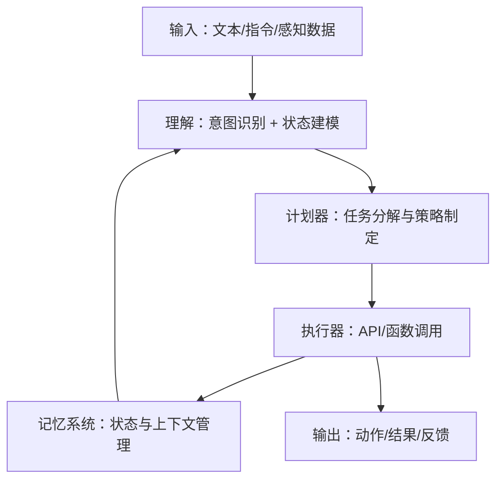

# 到底什么是一个合格的 AI Agent？

AI Agent 是当前技术圈的热词，但大多数文章讨论的，要么太抽象，要么太学术，常常让人看完一头雾水。在工程实践中，我们更关心的是：

> 如果我要上线一个 AI Agent，让它去执行任务、处理信息、和人交互——那它到底需要具备哪些能力，才算“合格”？

## 一、AI Agent ≠ ChatGPT

我们先把一些误解清掉：

- AI Agent 不等于聊天机器人；
- 也不是单纯的调用 LLM（大语言模型）API；
- 更不是一个 prompt + memory 的封装。

一个真正的 AI Agent 是一个**具备感知、理解、计划、执行能力的自治系统**。它不仅会“说”，还得能“做”；不仅能处理文本，还要能驱动系统完成任务。

换句话说，它**要能闭环**。

## 二、AI Agent 的基本结构



在工程实践中，这个结构可以解耦成多个服务或模块，结合 LLM + 工具调用 + 工作流编排来实现。

## 三、合格的 AI Agent 应该具备什么？

从实用角度看，一个合格的 AI Agent 至少应该满足以下五个维度：

| 维度       | 能力要求                                            |
| ---------- | --------------------------------------------------- |
| 理解能力   | 能准确解析用户意图、任务目标、上下文状态            |
| 执行能力   | 能调用工具/API/外部资源完成实际任务，支持多步骤行动 |
| 记忆能力   | 能追踪状态、记录上下文、维护长期目标与中间结果      |
| 计划能力   | 能将复杂目标拆解为子任务，有明确行动路径            |
| 自解释能力 | 能在失败、偏差或不可控时输出可理解的解释或日志      |

进一步加分项：

- **自我评估**：能对结果进行质量判断（比如调用失败时自动重试）
- **协作能力**：支持和其他 Agent 协同（比如调用另一个 Agent 来处理子任务）
- **环境适应**：能根据上下文和历史交互调整行为策略

## 四、工程视角下的指标判断标准

| 指标           | 描述                                            | 参考标准                        |
| -------------- | ----------------------------------------------- | ------------------------------- |
| 任务完成率     | Agent 能成功完成被委派任务的比率                | ≥ 90%                           |
| 工具调用成功率 | 在计划阶段调用函数/API 的成功率                 | ≥ 95%                           |
| 交互延迟       | 从用户输入到 Agent 生成响应的平均耗时           | < 2 秒（端到端）                |
| 上下文一致性   | Agent 是否理解连续上下文、前后逻辑是否连贯      | >= 85% 主观评估                 |
| 解释率/故障率  | Agent 能否清晰解释失败原因，系统是否能自动回退  | “有 fallback 机制”              |
| 可观测性       | 是否输出了合理的日志、trace、token 使用等元信息 | Prometheus / OpenTelemetry 集成 |

## 五、合格与不合格的差别在哪？

| 行为场景            | 合格 Agent 行为                          | 不合格 Agent 行为              |
| ------------------- | ---------------------------------------- | ------------------------------ |
| 用户提问跳转话题    | 能识别主题变换并切换对话上下文           | 一直回答旧话题，混淆逻辑       |
| 工具调用失败        | 提供失败原因，记录日志，并尝试恢复或放弃 | 返回“对不起我不明白”或直接崩溃 |
| 复杂任务（多步骤）  | 能生成合理计划并逐步执行                 | 要么只做一步，要么陷入循环     |
| 用户输入模糊/缺信息 | 回问 clarifying question，补全上下文     | 默认胡乱回答，结果偏离目标     |
| 状态跨轮记忆        | 记住目标并连续执行直到完成               | 每轮都“重新开始”，没有连贯性   |

## 六、设计一个合格的 AI Agent

1. **明确目标闭环路径**

   > 不要只让 Agent 聊天，要定义好它的“目标”和“工具链”。

   - 输入：Agent 接收什么？用户 prompt、指令、感知数据
   - 输出：Agent 负责交付什么？执行动作、调用结果、外部接口返回

2. **模块化拆分：不要让一个 LLM 负责所有事情**

   用 Orchestrator + LLM 调度更好：

   ```txt
   Planner（计划模块）：调用 LLM 生成行动步骤
   Executor（执行模块）：根据 LLM 的决策调工具
   Verifier（验证模块）：结果校验、fallback
   ```

3. **结构化工具接口设计**

   与其让 LLM 自由生成 API 调用，不如提供：

   - 强类型 schema
   - JSON 格式工具说明
   - 自动校验与兜底机制

4. **加上状态管理系统（Memory）**

   不能指望 LLM 一直记得之前说了什么。你需要：

   - 中间状态持久化
   - 会话级记忆 + 任务级记忆分离
   - 清晰的上下文更新策略（如 RAG）

5. **保留监控、日志与回溯能力**

   你得知道 Agent 在干什么、干得对不对、什么时候出错、为什么出错。

   推荐方案：

   - 使用 OpenTelemetry 打 trace
   - 所有 LLM 调用都加入日志与 token 记录
   - 每次工具调用都记录输入输出状态

## 七、结语：合格的 AI Agent 是一项系统工程

很多人以为 AI Agent 是 prompt 工程 + LangChain，但其实它更像是“一个小型的操作系统”。

它得会感知、理解、计划、执行，还要记得自己做了什么，为什么这么做，下一步准备干什么。如果它不能**持续达成目标并可控运行**，它就不合格。

> AI Agent 的“智能”不是 GPT 有多大，而是你能不能信任它完成工作。
