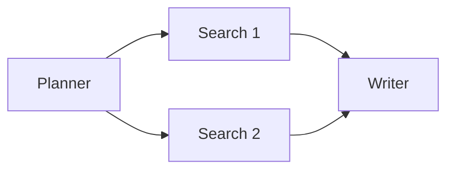

# 多 Agent 协同架构的实现细节

一个 AI Agent 系统的智能程度，不仅取决于每个 Agent 的能力，更取决于它们之间如何协作。

本篇我们聚焦「多 Agent 协同模式」，结合实际工程设计，拆解几种典型协同方案。

---

## 一、Agent 协同的三种核心模式

### 1. 串行协同（Pipeline）

Agent A → Agent B → Agent C  
适合任务有强顺序依赖，如：

```text
Planner → Searcher → Writer
```

任务链结构清晰，便于调试与监控。

---

### 2. 并行协同（Fork-Join）

多个 Agent 并行工作，聚合结果后继续：



适合任务可拆分的情境，如多源信息整合。

---

### 3. 层级协同（主控 Agent）

由一个高级 Agent（Boss）负责拆分与协调：

```ts
BossAgent.run(input) {
  const task1 = await planner.run(input);
  const task2 = await search.run(task1);
  const result = await writer.run(task2);
  return result;
}
```

适合复杂任务、动态决策、子任务不可预知。

---

## 二、如何在系统中实现协同流程

通过 NestJS 中控架构 + BullMQ 队列，每个 Agent 可以被视为一个异步 Worker：

- 每个任务有独立的任务 ID、上下文
- 状态通过 Redis 或数据库共享
- 上游 Agent 完成后可触发下游 Agent

### 任务上下文示例：

```json
{
  "taskId": "xyz-123",
  "pipeline": ["Planner", "Searcher", "Writer"],
  "context": {
    "plan": "...",
    "docs": [...],
    "draft": "..."
  }
}
```

---

## 三、多 Agent 流程的编排方式

### 1. 手工编排（配置驱动）

通过 YAML 或 JSON 定义流程图：

```yaml
taskType: write_article
pipeline:
  - PlannerAgent
  - SearchAgent
  - WriterAgent
```

中控根据配置动态加载 Agent 并调度。

---

### 2. DAG 编排（图结构）

使用 DAG 表达复杂依赖关系，适合多分支合并流程。

可用现有框架如：

- LangGraph
- Temporal.io
- 或自行实现图调度器

---

## 四、设计 Agent 插件标准

统一 Agent 接口：

```ts
export interface Agent {
  name: string;
  run(input: any, context?: TaskContext): Promise<AgentResult>;
}
```

Agent 运行结果被中控记录，并作为后续 Agent 输入。

---

## 五、异常与回滚机制

- 每个 Agent 执行失败后自动记录
- 中控支持失败重试 / fallback Agent
- 可引入 Dead Letter Queue 捕获长期失败任务

---

## 六、总结

一个强大的多 Agent 系统，需要合理设计协同策略：

- 简单任务走 pipeline
- 复杂任务用 DAG 或 Boss Agent 控制
- 所有状态都应可追踪、可监控、可回溯

配合一个稳定的[中控系统](./nest-multi-agent.md)，才能实现真正的多 Agent 协同能力。
