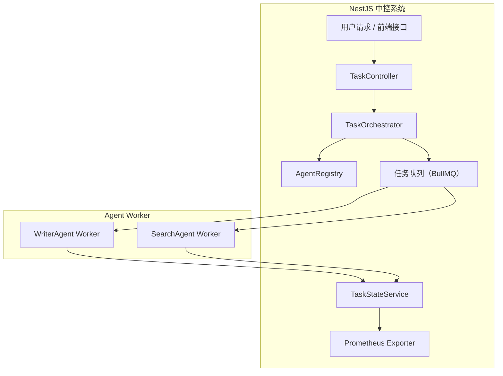

# 如何用 NestJS 构建一个 AI Agent 中控系统

AI Agent 系统正在从“单一任务执行”迈向“多 Agent 协同”的复杂工作流，而中控（Orchestrator）正是这个系统的“大脑”。本文将分享如何使用 [NestJS](https://nestjs.com/) 构建一个模块化、可扩展、支持监控的中控系统，调度多个异步 Agent 高效协作。

---

## 一、背景与核心目标

在多 Agent 系统中，单个 Agent 通常职责单一：如撰写、搜索、审校、总结等。中控系统的职责包括：

- 接收用户请求
- 拆解任务，调度多个 Agent 协同处理
- 管理任务状态、上下文与进度
- 提供统一监控与可观测性

---

## 二、系统架构总览

我们先看架构图：



---

## 三、模块职责划分

### 1. `TaskController` — 用户接口入口

负责接收外部请求，常见如：

```ts
@Post('/task')
createTask(@Body() dto: CreateTaskDto) {
  return this.taskOrchestrator.dispatch(dto);
}
```

---

### 2. `TaskOrchestrator` — 中控核心模块

任务调度核心逻辑，包括：

- 拆解任务（如需要先搜索再撰写）
- 将子任务推送至 BullMQ 队列
- 设置依赖关系或顺序控制（可选）

```ts
async dispatch(dto: CreateTaskDto) {
  const agents = this.registry.resolveAgents(dto.taskType);
  for (const agent of agents) {
    await this.queueService.enqueue(agent.queueName, {
      taskId: dto.id,
      payload: agent.prepare(dto),
    });
  }
}
```

---

### 3. `AgentRegistry` — Agent 动态注册表

每个 Agent 都注册自己的元信息：

```ts
registerAgent({
  name: "WriterAgent",
  queueName: "writer",
  prepare: (dto) => ({ content: dto.topic }),
});
```

支持插件式拓展，未来可以支持热插拔、心跳检测等。

---

### 4. `TaskStateService` — 状态管理

用于存储 Agent 执行过程中的中间状态、最终输出。

```ts
async updateState(taskId: string, result: AgentResult) {
  await this.cache.set(taskId, JSON.stringify(result));
}
```

可使用 Redis / Mongo / 内存 等存储策略。

---

### 5. `BullMQ` — 解耦任务调度

中控系统和各 Agent 通过 BullMQ 队列异步通信。

配置示例：

```ts
BullModule.registerQueue({
  name: "writer",
  connection: { host: "localhost", port: 6379 },
});
```

每个 Agent Worker 在独立服务中监听自己的队列。

---

### 6. `Prometheus Exporter` — 指标监控

集成 `@willsoto/nestjs-prometheus` 实现指标导出：

```ts
@Counter({ name: 'agent_task_total', help: 'Total number of agent tasks' })
countTasks() {
  return this.stateService.getAll();
}
```

支持输出任务量、失败率、平均响应时间等。

---

## 四、Agent Worker 实现（独立服务）

一个典型 Agent Worker（如 WriterAgent）：

```ts
@Processor("writer")
export class WriterProcessor {
  constructor(private readonly state: TaskStateService) {}

  @Process()
  async handleJob(job: Job<AgentPayload>) {
    const result = await this.runAgent(job.data.payload);
    await this.state.updateState(job.data.taskId, result);
  }

  private async runAgent(payload: any): Promise<AgentResult> {
    // 实际调用大模型 / 自定义逻辑
    return { output: `Written content for ${payload.content}` };
  }
}
```

---

## 五、中控系统的扩展建议

1. **支持任务依赖图（DAG）**：如先搜索再撰写，可用队列嵌套或 `workflow engine` 管理依赖。
2. **Agent 健康检查与自动重试机制**
3. **全链路日志跟踪（如 Zipkin + OpenTelemetry）**
4. **多租户隔离或分布式部署**

---

## 六、总结

通过 NestJS 提供的模块化架构、装饰器语义、BullMQ 的异步调度能力，以及 Prometheus 的监控支持，我们可以构建一个清晰、可靠、可观测的 AI Agent 中控系统。未来你可以很容易地拓展更多 Agent，实现复杂的多阶段协同处理任务。

下一篇[多 Agent 的协同模式设计与调度策略](./multi-agent-workflow.md)
