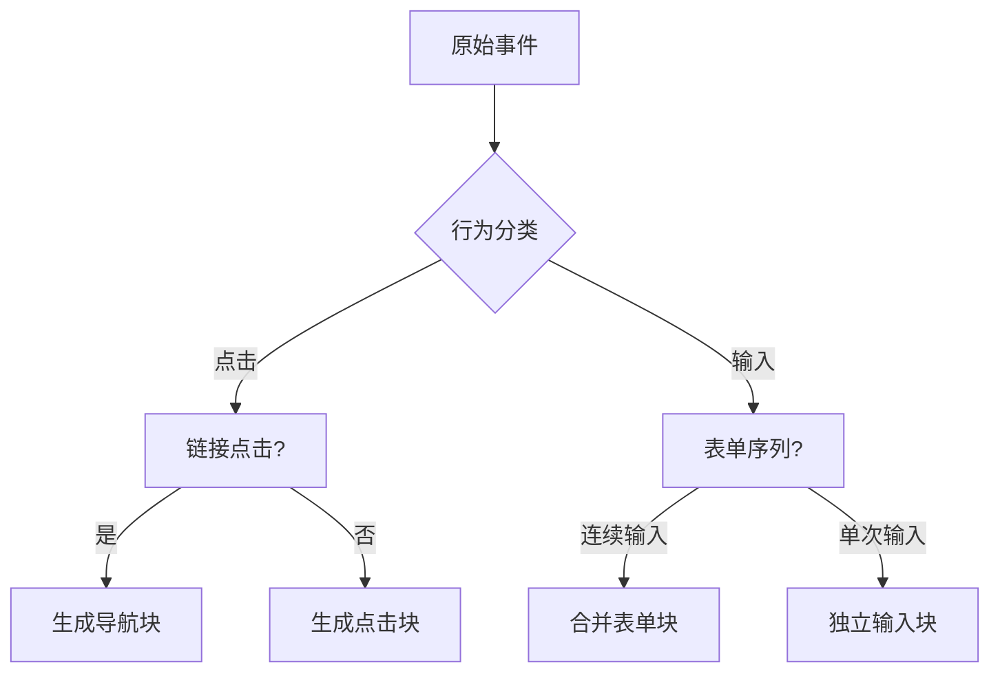

# automa 工作流录制功能深度解析

## 一、架构设计

### 1.1 模块化设计

工作流录制功能采用分层架构设计：

```
录制系统
├── 核心层 (recordEvents.js)
│   ├── 事件监听器
│   ├── 选择器生成器
│   └── 行为分析器
├── 界面层 (App.vue)
│   ├── 控制面板
│   └── 状态指示器
├── 逻辑层 (addBlock.js)
│   ├── 块生成器
│   └── 行为转换器
└── 通信层 (index.js)
    ├── 跨框架通信
    └── 消息总线
```

### 1.2 关键文件说明

| 文件路径                          | 职责      | 核心技术         |
| --------------------------------- | --------- | ---------------- |
| `/recordWorkflow/index.js`        | 入口协调  | 消息路由         |
| `/recordWorkflow/main.js`         | UI 初始化 | Shadow DOM       |
| `/recordWorkflow/recordEvents.js` | 事件捕获  | 事件委托         |
| `/recordWorkflow/App.vue`         | 用户界面  | Vue 3 组合式 API |
| `/recordWorkflow/addBlock.js`     | 块转换    | 行为模式识别     |

## 二、核心实现机制

### 2.1 事件捕获系统

```javascript
// 典型事件监听配置
const eventConfig = {
  click: {
    capture: true,
    passive: true,
    // 特殊处理逻辑
    filter: (target) => !isIgnoredElement(target),
  },
  input: {
    debounce: 300, // 防抖延迟
    // 输入类型检测
    typeDetect: (el) => el.type || "text",
  },
};

// 事件处理器注册
function initEventListeners() {
  document.addEventListener("click", handleClick, eventConfig.click);
  document.addEventListener(
    "input",
    debounce(handleInput, 300),
    eventConfig.input
  );
  // 其他事件...
}
```

### 2.2 智能选择器生成

采用改良版的 CSS 选择器生成算法：

1. **优先级策略**：

   - ID 选择器（最高优先级）
   - 类名组合（`.btn.primary`）
   - 属性选择器（`[data-testid="submit"]`）
   - 结构化路径（`div > form > button`）

2. **容错处理**：

```javascript
function generateFallbackSelector(target) {
  // 当常规选择器不唯一时
  return [
    `:nth-child(${getChildIndex(target)})`,
    `:contains("${target.textContent.slice(0, 20)}")`,
  ].join("");
}
```

### 2.3 行为模式识别



## 三、高级功能实现

### 3.1 跨 iframe 录制

```javascript
// 主框架通信协议
const frameCommunication = {
  // 子帧向父帧报告
  reportEvent: (eventData) => {
    const framePath = getFramePath(window);
    parent.postMessage(
      {
        type: "automa:frame-event",
        framePath,
        event: eventData,
      },
      "*"
    );
  },

  // 父帧整合事件
  integrateEvent: (event) => {
    const fullSelector = [
      ...event.framePath.map((f) => `iframe:nth-child(${f})`),
      event.selector,
    ].join(" > ");
    // 生成包含iframe路径的选择器
  },
};
```

### 3.2 智能防抖系统

```javascript
class EventDebouncer {
  constructor() {
    this.timers = new Map();
    this.defaultDelay = 300;
  }

  register(eventType, callback, delay = this.defaultDelay) {
    // 实现类型特定的防抖控制
    if (eventType === "scroll") {
      return this._handleScroll(callback);
    }
    // 标准防抖实现
    return (...args) => {
      clearTimeout(this.timers.get(eventType));
      this.timers.set(
        eventType,
        setTimeout(() => {
          callback(...args);
        }, delay)
      );
    };
  }
}
```

## 四、扩展开发指南

### 4.1 添加新事件类型

1. **注册新事件处理器**：

```javascript
// 在recordEvents.js中扩展
export function initCustomEvents() {
  document.addEventListener("mouseover", handleHover, {
    capture: true,
    // 防止过度触发
    throttle: 200,
  });
}
```

2. **定义行为转换规则**：

```javascript
// 在addBlock.js中添加
function handleHoverEvent(event) {
  return {
    type: "hover-interaction",
    selector: generateSelector(event.target),
    config: {
      hoverDuration: 500, // 可配置参数
    },
  };
}
```

### 4.2 自定义选择器策略

实现自定义选择器生成器：

```javascript
// 自定义选择器配置
const customSelectors = {
  preferAttributes: ["data-testid", "data-qa"],
  ignoreClasses: ["temp", "dynamic"],
  // 元素权重计算
  weightCalculator: (element) => {
    if (element.id) return 100;
    if (element.dataset.testid) return 80;
    // ...其他规则
  },
};

// 集成到现有系统
finder.configure(customSelectors);
```

### 4.3 性能优化建议

1. **事件监听优化**：

```javascript
// 使用事件委托替代单独监听
document.body.addEventListener(
  "click",
  (e) => {
    if (e.target.closest(".recordable")) {
      handleRecordableClick(e);
    }
  },
  { passive: true }
);
```

2. **内存管理**：

```javascript
// 清理不再需要的引用
function cleanup() {
  recordedEvents.forEach(event => {
    if (event.target?.removeEventListener) {
      event.target.removeEventListener(...);
    }
  });
}
```

## 五、调试技巧

### 5.1 录制状态可视化

```javascript
// 在开发模式下添加调试标记
if (process.env.NODE_ENV === "development") {
  document.documentElement.style.setProperty(
    "--automa-debug-outline",
    "2px dashed red"
  );
}
```

### 5.2 事件流监控

```javascript
// 记录事件流水
const eventLog = new Proxy([], {
  set(target, prop, value) {
    console.log("[Event Flow]", value);
    return Reflect.set(...arguments);
  },
});
```

## 六、架构演进建议

1. **插件式事件处理器**：

```javascript
// 动态加载事件模块
const eventHandlers = {
  click: import("./handlers/click"),
  input: import("./handlers/input"),
  // ...
};

// 按需注册
Object.entries(eventHandlers).forEach(([type, handler]) => {
  document.addEventListener(type, handler);
});
```

2. **机器学习增强**：

- 使用 TensorFlow.js 分析 DOM 结构模式
- 预测用户意图自动优化工作流
