# 前端基建体系化建设指南

## 一、基建战略定位

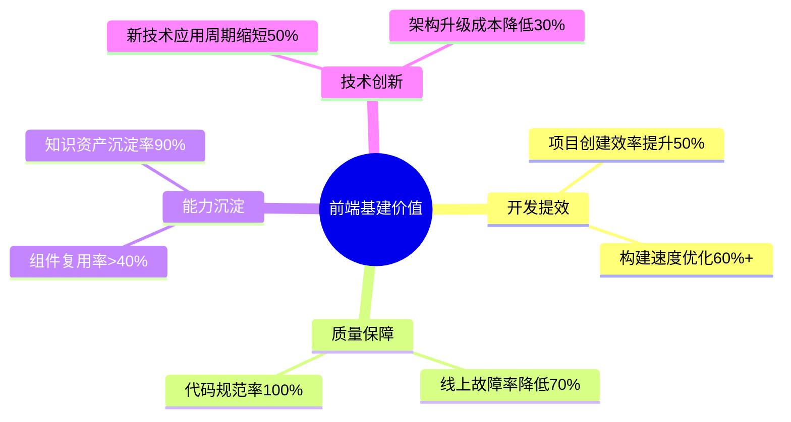

## 二、三级能力体系

### 1. 基础能力层（P0）

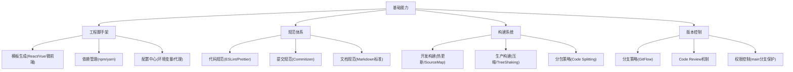

**实施路径**：

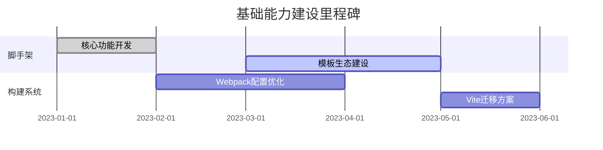

### 2. 质量保障层（P1）

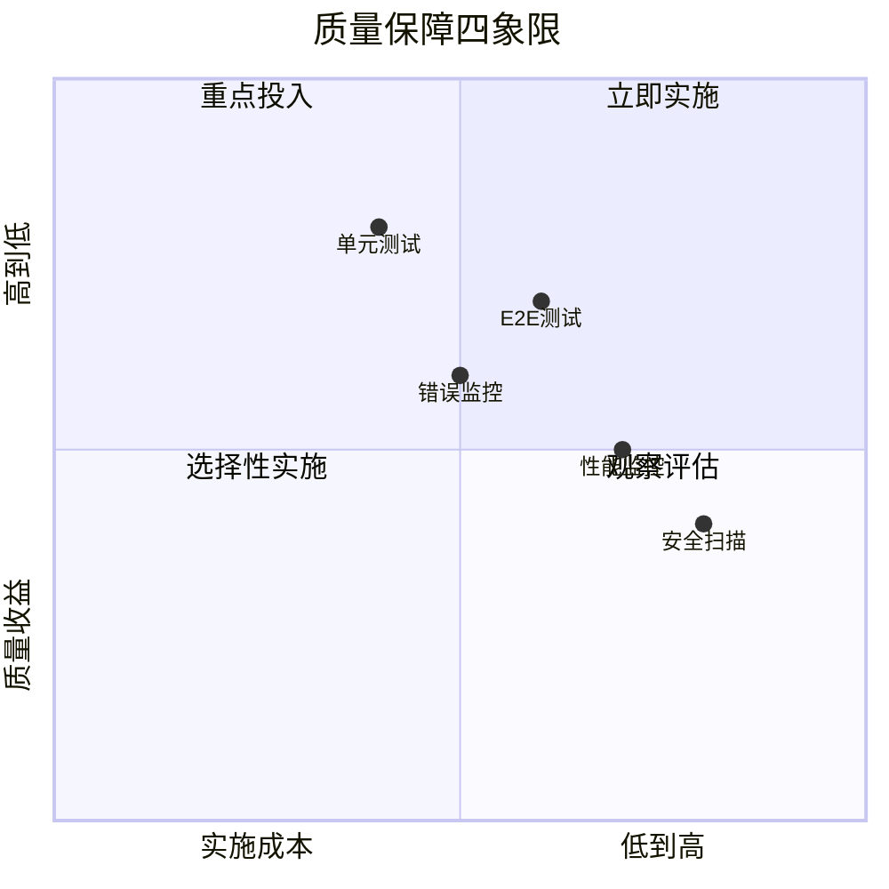

**工具矩阵**：
| 质量维度 | 工具链 | 验收标准 |
|---------|--------|----------|
| 代码质量 | ESLint + SonarQube | 零错误警告 |
| 测试覆盖 | Jest + Cypress | 核心路径 100%覆盖 |
| 线上监控 | Sentry + Lighthouse | 故障响应<5 分钟 |
| 安全防护 | CSP + Snyk | 高危漏洞清零 |

### 3. 效能提升层（P2）

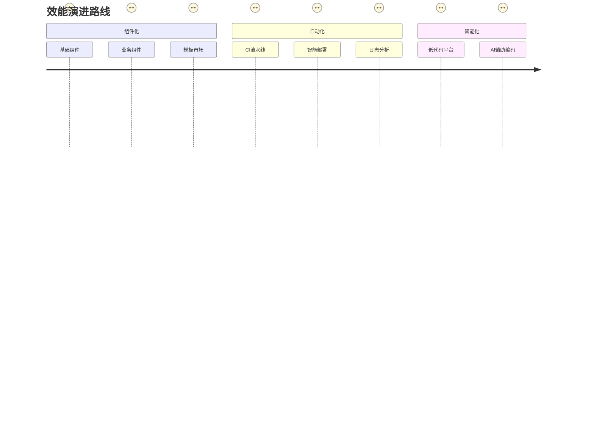

**关键指标看板**：

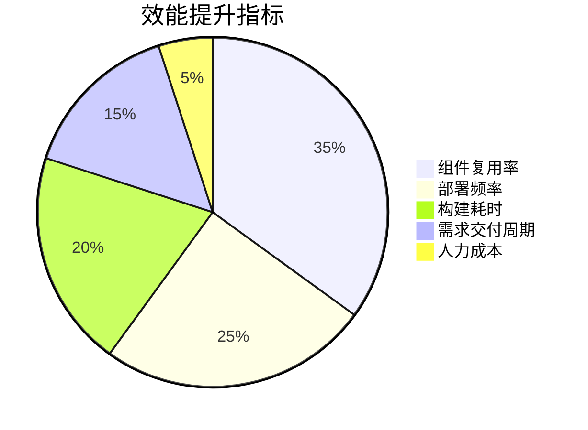

## 三、实施路线图

### 阶段一：筑基期（0-3 个月）

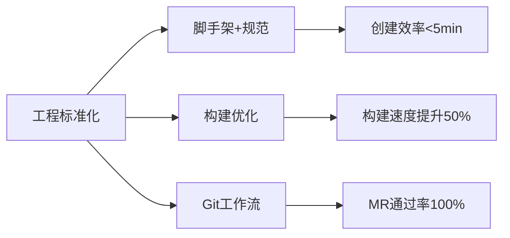

### 阶段二：提质期（3-6 个月）

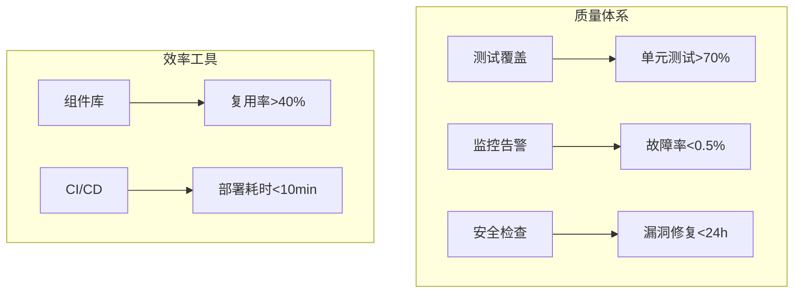

### 阶段三：智能期（6 个月+）

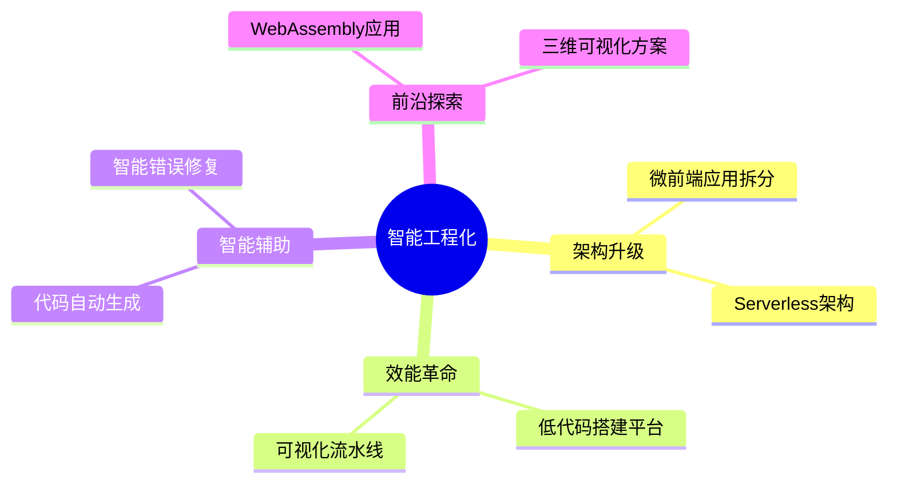

## 四、实施保障机制

### 1. 资源分配模型

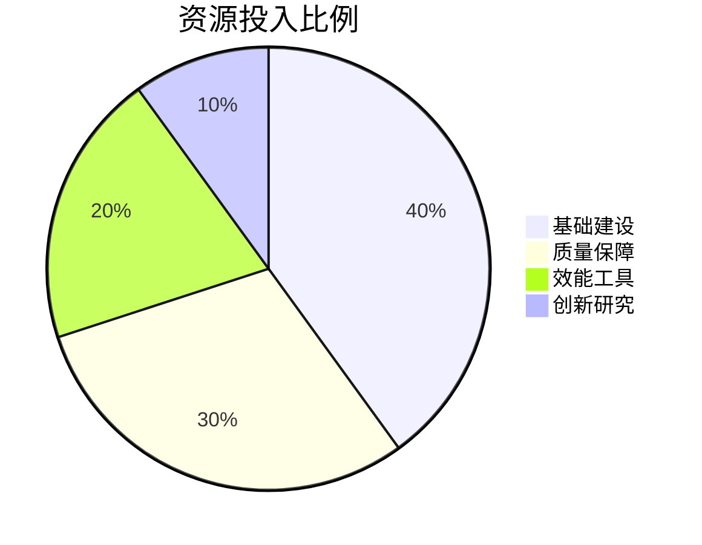

### 2. 效果评估体系

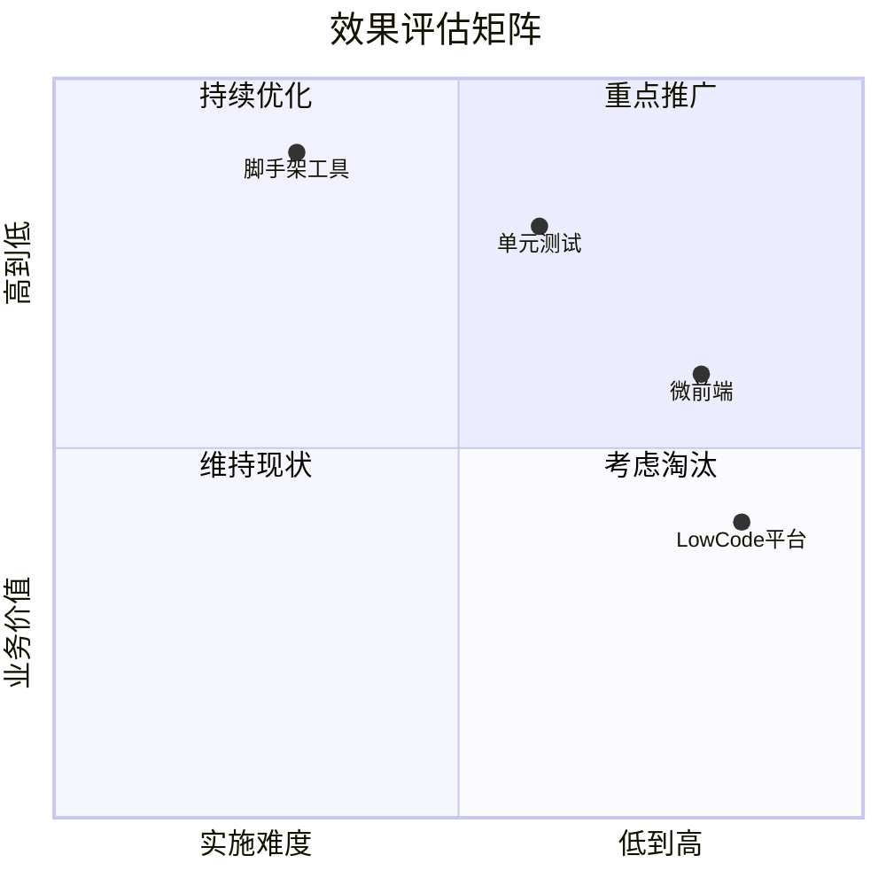

### 3. 持续演进机制

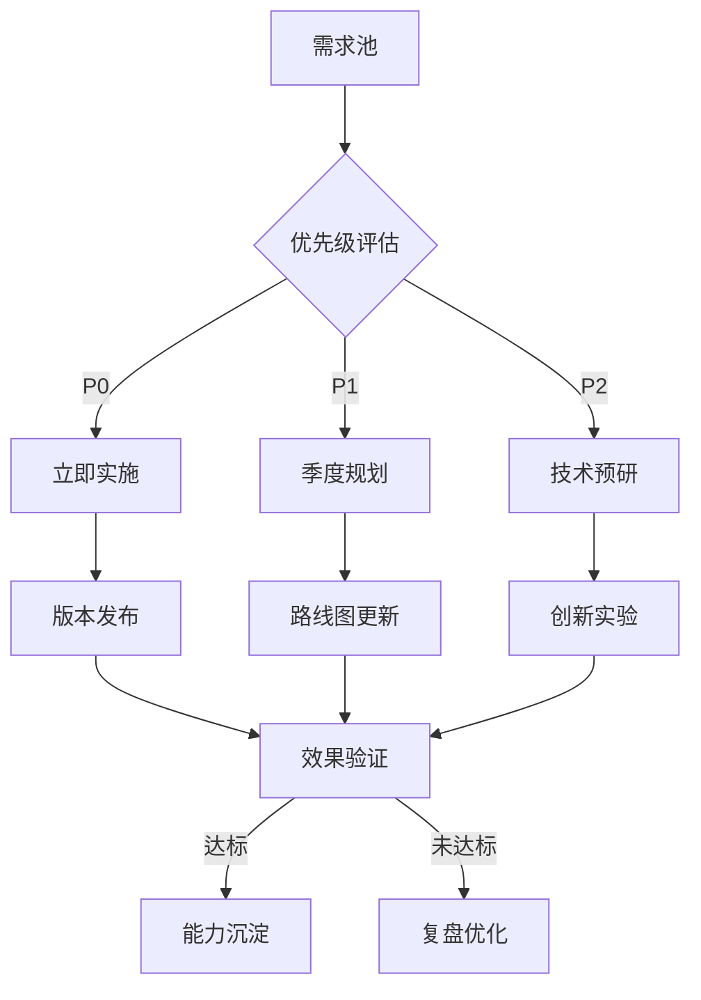

## 五、实践建议

1. **分阶段推进**：遵循「脚手架->规范化->自动化->智能化」路径
2. **指标驱动**：建立量化指标体系，每月发布基建健康度报告
3. **生态建设**：构建包含这些要素的闭环体系：

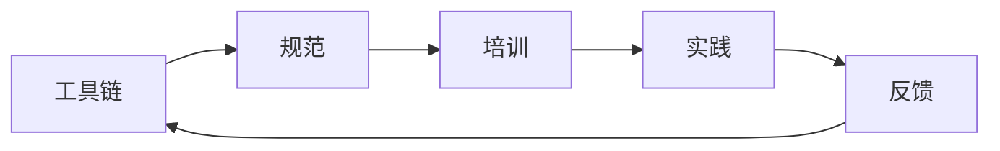

4. **技术雷达**：每季度更新技术选型评估：

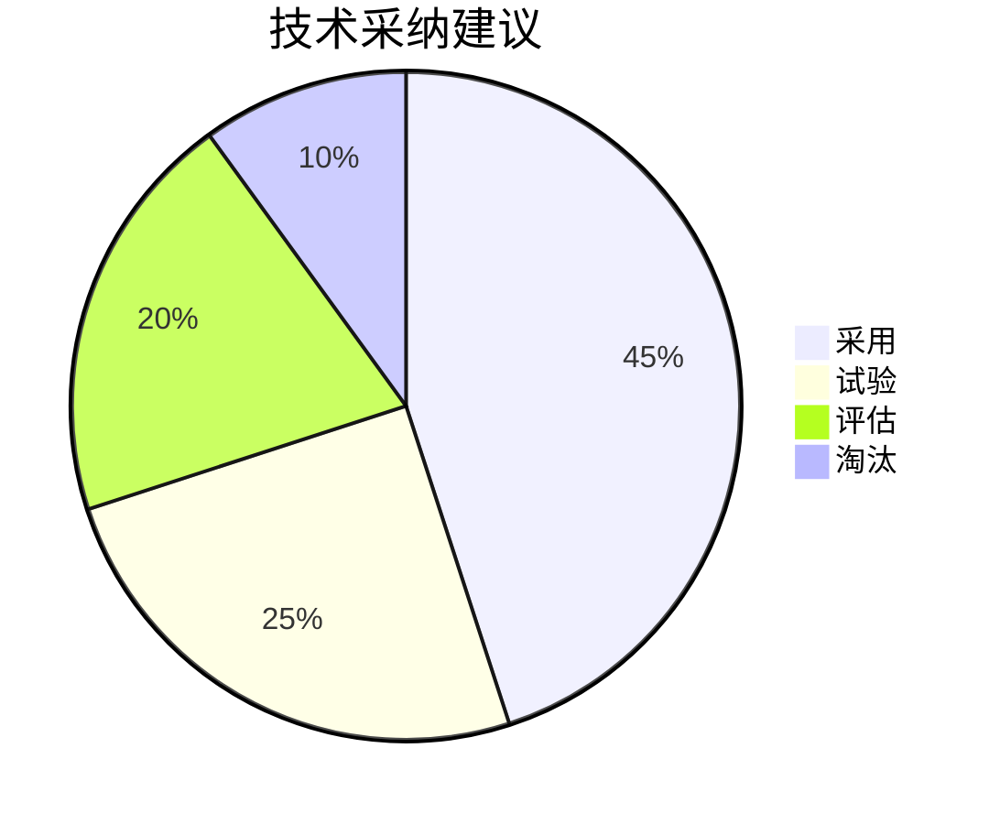
