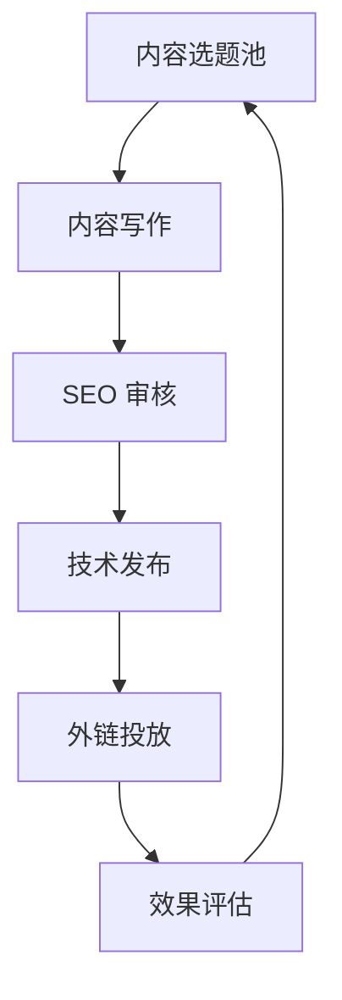

# 🧩 轻量级 SEO 内容中台方案

> 🎯 目标：支撑 SEO 内容策划、撰写、发布、归档、复用全链路，提升内容协作效率与 SEO 转化效果。

---

## 🧱 一、核心诉求

| 需求              | 说明                                               |
| ----------------- | -------------------------------------------------- |
| ✅ 多角色协作     | 前端、运营、内容团队需协同产出内容                 |
| ✅ 模块化内容管理 | 各种类型内容统一结构管理（如博客、对比页、案例页） |
| ✅ 多语言支持     | 英文 / 日文并行支持                                |
| ✅ 快速发布能力   | 支持草稿发布、定时发布、静态化导出等               |
| ✅ 可追踪         | 可追踪内容来源、外链效果、SEO 指标变化             |

---

## 🔧 二、推荐技术选型（轻量级）

| 模块           | 技术方案                   | 理由                         |
| -------------- | -------------------------- | ---------------------------- |
| 内容结构管理   | Notion / Strapi / Sanity   | 快速建立内容模型，非开发可用 |
| 内容产出协作   | Notion / Google Docs       | 撰写协作最流畅               |
| 内容发布通道   | MDX + Next.js/VitePress    | 支持 SEO、预渲染、快速部署   |
| 内容追踪与评估 | Google Analytics + Ahrefs  | 域名权重与内容转化评估       |
| 自动化         | GitHub Actions + Turborepo | 内容自动同步 + 构建发布      |

---

## 🧩 三、模块设计（内容模型）

```yaml
- 内容类型
  - 博客 Blog
  - 对比页 Compare
  - 客户案例 Case Study
  - 产品教程 Guide
  - 词条/概念 Glossary

- 字段定义
  - slug: 唯一标识（URL路径）
  - title: 标题
  - summary: 摘要
  - keywords: 关键词
  - lang: en / ja
  - status: 草稿 / 待审核 / 已发布
  - publish_at: 发布时间
  - author: 负责人
  - link: 关联链接（如 G2 / 外链来源）
```

可通过 Notion 或 Headless CMS 自定义以上结构，实现轻量中台效果。

---

## 🚀 四、内容产出流程（内容生命周期）



### 工具建议：

| 阶段 | 工具                                |
| ---- | ----------------------------------- |
| 选题 | Notion「选题看板」模板              |
| 写作 | Google Docs / Notion                |
| 审核 | Notion 评论 + Grammarly（英文润色） |
| 发布 | Git + MDX + Next.js                 |
| 外链 | 外链数据库 + outreach 邮件          |
| 评估 | GA + Ahrefs 看点击与收录            |

---

## 🌐 五、内容分发策略（分语言 + 分渠道）

### 英文（美国市场）

- Dev.to / Medium / Product Hunt Blog
- Reddit / Quora 回复引流
- 外链来源页面同步英文内容

### 日文（日本市场）

- Zenn / Note.jp / Qiita
- 建立「用影刀实现自动化」实操文集
- 可考虑与日本 IT 博主合作转发

---

## 📊 六、系统功能拓展建议

| 阶段   | 功能建议                                  |
| ------ | ----------------------------------------- |
| 初期   | Notion 中台，手动发布内容                 |
| 中期   | 接入 Strapi 或 Sanity，实现内容统一管理   |
| 中后期 | 内容埋点分析，按关键词效果做排序与推荐    |
| 长期   | 与海外 CRM / 培训系统联动做内容个性化推荐 |

---

## ✅ 七、优势总结

- 成本低，5 人前端团队可快速实现
- 易于迭代和维护，不需要重型 CMS
- 支持内容标准化 + 多语言扩展
- 可和 SEO 外链策略联动打通
- 可结合 AI 实现内容生成辅助（如关键词拓展、AI 写草稿）

---

- ✅ [内容中台前后端结构图](./system-structure.md)
- ✅ [内容类型分类清单](./content-type-list.md)（含示例）

