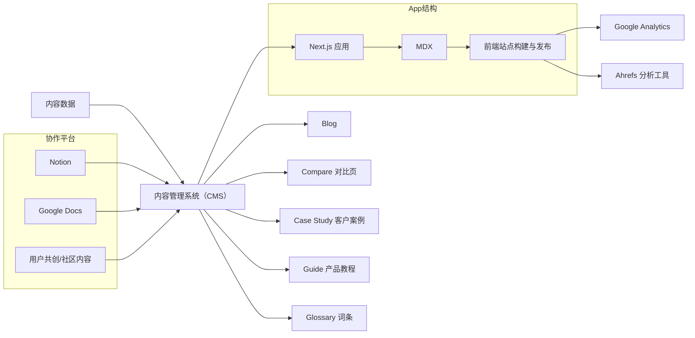

## 轻量级 SEO 内容中台前后端结构图

```mermaid
flowchart LR
    A[内容数据] --> CMS[内容管理系统（CMS）]
    CMS --> B1[Blog]
    CMS --> B2[Compare 对比页]
    CMS --> B3[Case Study 客户案例]
    CMS --> B4[Guide 产品教程]
    CMS --> B5[Glossary 词条]

    subgraph 协作平台
        N1[Notion]
        N2[Google Docs]
        N3[用户共创/社区内容]
    end

    N1 --> CMS
    N2 --> CMS
    N3 --> CMS

    CMS --> App[Next.js 应用]

    subgraph App结构
        App --> MDX[MDX]
        MDX --> Deploy[前端站点构建与发布]
    end

    Deploy --> GA[Google Analytics]
    Deploy --> Ahrefs[Ahrefs 分析工具]
```